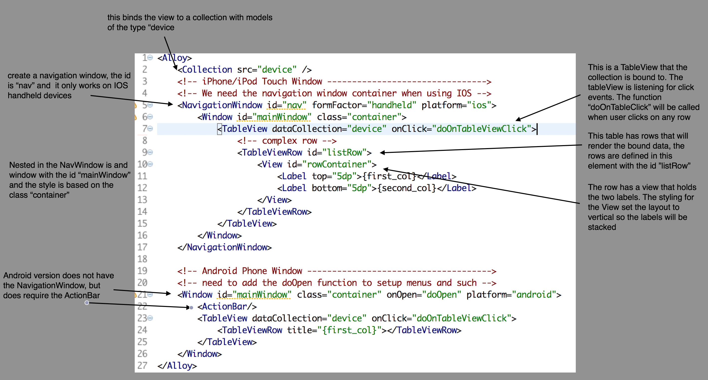

##Sample Appcelerator Alloy Mobile Project for Howard U SCS Cross-Platform Mobile App Dev Class

* Project is based off of the default 2 Tab template available in Titanium Studio.
* Project is a sample demonstrating the use of a restApi sync adapter along with Model/Collection Databinding to a TableView
* The project is connected to a Kinvey Datasource back end. See [Kinvey](www.kinvey.com) to setup a free account to fully utilize this application
* This code should run successfully on IOS and Android using the Appcelerator 3.5.0 SDK

____
###Getting Started
Please setup your constants by modifying the file [`kinveyConstants.js`](app\lib\kinveyConstants.js) in the `app\lib` directory of your project

Modify the code below to use your values from the kinvey console

````Javascript
exports.constants = {
	url : 'https://baas.kinvey.com/appdata/kid_-XXXXXXX/Devices',
	basicAuthValue : 'Basic a2lkXy1KZWlXXXXXXXOTliY2RhMDE0YzQ5ZDBmNjY2OA=='
};
````
###Devices Model js file
This file is where the application is a bit different from the default model file.

The default file starts off like this
````Javascript
exports.definition = {
	config: {

		adapter: {
			type: "properties",
			collection_name: "Foo"
		}
	},
	extendModel: function(Model) {
		_.extend(Model.prototype, {
			// extended functions and properties go here
		});

		return Model;
	},
	extendCollection: function(Collection) {
		_.extend(Collection.prototype, {
			// extended functions and properties go here
		});

		return Collection;
	}
};

````
Lets start to explain the changes we have made...first off at the top, we are using javascript require to include the `kinveyConstants.js` discussed above. This will provide access to the constants in the model.

````Javascript
// I have saved constants in an external file that is included here using the
// javascript requires functionality
//
// Best Practices for Alloy and discussion on requires:
//    http://docs.appcelerator.com/titanium/3.0/#!/guide/Alloy_Best_Practices_and_Recommendations
//
var KINVEY_CONST = require("kinveyConstants").constants;
````
#####Set the Sync Adapter
Next we need to set the model to use the appropriate sync adapter. I have included a default sync adapter that we have used on some projects that you are welcome to use.

You need to make sure the sync adapter that you use in included in the `lib/alloy/sync` directory in the project. In this case, the file name in [`restapi.js`](lib/alloy/sync/restapi.js)


````Javascript
config : {
	adapter : {
		// Specifiy the sync adapter to use for this model
		// and collection
		type : "restapi",

		// collection name property, not really needed when using
		// the REST API sync adapter
		collection_name : "devices"

		// the field in the object that represents the id
		idAttribute : "_id"		
	}
},
````
#####Extend the Model to Specify URL
For the sync adapter to work with a rest API, it needs a base url. We provide a function that will return the base url for the model and collection. We have the value for the url in the `kinveyConstants.js` file that we loaded up in the top of the models file... this is how we use the object `KINVEY_CONST` we loaded up

````Javascript
_.extend(Model.prototype, {
	// extended functions and properties go here
	url : function() {
		return KINVEY_CONST.url;
	}
});
````
This code is extending the default object to include/override the existing function with a new function to provide the base url. Additional infomation on [`baseUrl`](http://backbonejs.org/#Collection-url) can be found in the [BackboneJS Documentation](http://backbonejs.org/)

#####Extend the Model to Specify Authorization Header
For this example, we are authenticating our API calls with Basic Auth using the headers; This is not the recommended apporoach, but meets the needs of this sample.

BackboneJS allows for specifying the headers before the request is made by setting the `beforeSend` property with a function to call before sending the request. We will use that property to call a function that will set the authentication header.

The code for the function to set the headers can be placed in the controller and would need to be used everytime you wanted to access a collection, but from a design approach it might be better to keep the code in the model.

What we have done is extend the model with a function to set the headers on the request. The function is added here, in the controller code, you will see how it is utilized.

````Javascript
_.extend(Collection.prototype, {
	// extended functions and properties go here
	/**
	 * a function for setting the header when requests are made.
	 *
	 * @param {Object} xhr
	 */
	setHeader : function(xhr) {
		xhr.setRequestHeader("Authorization", KINVEY_CONST.basicAuthValue);
	},
});
````
#####Fetching the Data in `index.js`
In the index controller we can now create a new `Devices` collection by using the `Alloy.instance` function'

`var devicesCollection = Alloy.Collections.instance("Devices")`

this will get the existing collection or create a new collection based on the information in the Devices model .js file.

Now that we have a `devicesCollection` object now lets call the `fetch` method to get the data associated with the collection. The data associated with the collection will be returned as model objects. Remember though that we need to set the header for the authentication by using the function we added to the collection.

See the BackboneJS [`Collection.fetch`](http://backbonejs.org/#Collection-fetch) documentation for additonal information of fetch and the associated options.

````Javascript
devicesCollection.fetch({
	beforeSend : devicesCollection.setHeader, // the function from the extended collection
	success : function(collection, response, option) {
		// dump the results from the fetch to the console
		console.log("Collection Response: " + JSON.stringify(collection, null, 2));
	},
	error : function(collection, response, option) {
		console.log('ERROR ' + collection);
	}
});
````
We can extend the collection model to make it easier to fetch the data without always specifying the header informtion in your controller code. We will extend the Collection object to set the `beforeSend` property for you when you use the new function `Collection.getAll`. All the other parameters and options are the same as the default `fetch` function call.

````Javascript
/**
 * a helper function to simplify the fetching of the collection and hiding
 * the complexity setting the headers on each request
 *
 * @param {Object} _options
 */
getAll : function(_options) {
	this.fetch(_.extend(_options, {
		beforeSend : this.setHeader
	}));
}
````
#####Style & Layout of `index.xml` View Using `index.tss`

Items that start with a period like `.container` define a class that can be assigned to any object in the view
````css
".container": {
	backgroundColor: "white"
}
````
Items that are Titanium UI object can be styled by creating an entry using the object name. In the example below `TableView` defines a class that will be assigned to any `TableView` object in the view
````css
"TableView": {
	separatorColor: 'transparent'
}
````
Items can be styled specifically by using the item id in the `.tss` file. The entry below reflects a object with the id `#listRow` that will be styled using the information provided.
````css
"#listRow":{
	layout: 'horizontal',
	width: "100%",
	height: 'auto',
	selectionStyle: "NONE"
}
````

#####Binding the the Data in `index.xml`  View

Explaining the index.xml [(click to open in fullscreen)](https://raw.githubusercontent.com/aaronksaunders/scs-backbonetest1/master/screens/explaining-the-index-xml.png)



[Alloy Data-Binding Documentation](http://docs.appcelerator.com/titanium/3.0/#!/guide/Alloy_Data_Binding)

#####Responding to Events in `index.xml` View

The click event listener is on the `TableView` so since events bubble up, we will get the click events on all of the rows and we only need to create one listner instead of putting a listener on each row.

We define our event listener on the object, `doOnTableViewClick` in the `index.xml` view but we could also defined the event listener in the javascript like this.

````Javascript
$.tableView.addEventListener('click', doOnTableViewClick);
````
if you use this approach, please be certain to remove the event listener when exiting/closing the controller

````Javascript
function doOnTableViewClick(_event) {

	// use the 'index' property from the event to determine
	// which model from the collection was selected
	var currentItem = deviceCollection.at(_event.index);
	
	// log for debugging purposes and convert object to 
	// string that is readable
	console.log(JSON.stringify(currentItem, null, 2));

	// create the new controller and pass in the
	// model object as an argument 'item'
	var ctrl = Alloy.createController('detail', {
		'item' : currentItem
	});
}
````
#####Saving new Models

Extended the default `device` model object to handle the Kinvey authentication by creating a new save method called `authSave` which will set the authentication header on the http request which is required by Kinvey.

The extended model code in `app\models\device.js` looks like this
````Javascript
extendModel : function(Model) {
	_.extend(Model.prototype, {
		// extended functions and properties go here
		url : function() {
			return KINVEY_CONST.url;
		},
		authSave : function(_options) {
			this.save({},_.extend(_options, {
				beforeSend : function(xhr) {
					xhr.setRequestHeader("Authorization", KINVEY_CONST.basicAuthValue);
				}
			}));
		}
	});

	return Model;
},
````
In our application we can create a new object by following the steps outlined in the code below.
````Javascript
// create a new model and save it
//1) create a model object
var deviceModel = Alloy.Models.instance("device");

// 2) set attributes on the model
deviceModel.set({
	"first_col" : "Added from Appcelerator",
	"second_col" : "So we begin",
});

// 3) save the model using the extended helper function created
// to encapsulate the kinvey authentication in the model object
deviceModel.authSave({
	success : function(_model, _responseText) {
		// log the output
		console.log("deviceModel.save: " + JSON.stringify(_model, null, 2));
	},
	error : function(_model, _responseText) {
		// log an error
		console.log("Error- deviceModel.save " + _responseText);
	}
});
````
